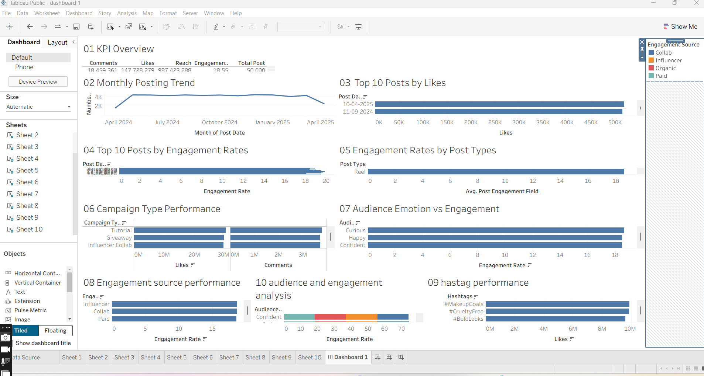

# Sugar Cosmetics Social Media Analytics Dashboard

## Project Overview
A Tableau dashboard analyzing Sugar Cosmetics Instagram social media performance.

## Objectives
- Analyze monthly posting trends
- Identify top-performing posts
- Compare engagement rates
- Analyze campaign performance
- Understand audience emotions
- Evaluate engagement sources
- Analyze hashtag performance

## Tools Used
- Tableau
- Data Visualization
- Social Media Analytics

## Dashboard

## Analysis
The dashboard includes:
- KPI Overview
- Monthly Posting Trend
- Top 10 Posts by Likes
- Top 10 Posts by Engagement Rate
- Engagement Rate by Post Type
- Campaign Type Performance
- Audience Emotion vs Engagement
- Engagement Source Performance
- Hashtag Performance
- Audience and Engagement Analysis

## Skills Demonstrated
Tableau | Data Visualization | KPI Analysis | Dashboard Design | Social Media Analytics
